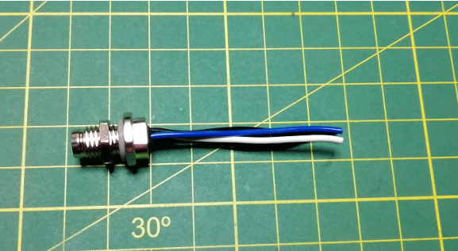

# Manual de fabricación
A continuación, se procede a describir los pasos a realizar de forma consecutiva. En caso se requiera más detalle se recomienda ponerse en contacto con el autor.

## Crimpado del conector
Con una regla medir 4.5 cmde cable, luego realizar un corte con la ayuda del pelacables, retirar aproximadamente 4 mm del revestimiento del cable. Ubicar los pines 24-30AWG y realizar el crimpado, se debe asegurar que el pin no quede suelto.

## Inserción hacia el conector

Insertar los pines en el conector Rect 4 pines mediante la siguiente tabla de configuración. Se debe asegurar que ninguno de los pines esté suelto para su buen funcionamiento.

## Enfocar cámara

Para más detalle de este procedimiento ver el documento [Enfocar cámara FCS](enfoque-camara.md)