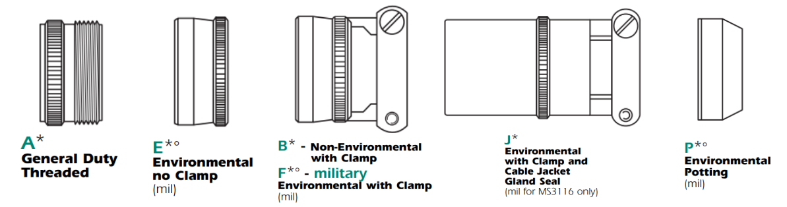

# Conector militar
En MS4M se usan 4 tipo de conectores para la control screen. Los número de parte iniciales son los siguientes:

* **KPSE6E16-26PDN:** Usado para el cable arnes con pines machos
* **KPSE6E16-26SDN:** Usado para el cable arnes con pines hembra.
* **KPT7A16-26SEW:** Este es un conector hembra, se encuentra en la control screen.
* **KPT7A16-26PEW:** Este es un conector macho, se encuentra en la control screen.

## ¿Como seleccionar un conector militar para cable arnes?

Lo primero que de debe hacer es escoger el standar con el cual se va a trabajar, estos estandares tienen impacto en la calidad y precio del conector.

### MS3126, KPSE06, KPSE05A, 85106
Los conectores que comiencen por esta serie son usando para armar cable arnes.

{align=center}

El conector **KPSE05A** cuenta con menos tipo de backshell.

### Escoger el tipo de backshell

Este valor esta representado por una letra que tiene equivalencia con la siguiente imagen:

Entonces para hacer un cable arnes, se podria escoger en principio

1. MS3126 **A**  

Para la serie **KPSE06** y **KPSE05A** estan disponibles los siguientes backsheel

Entonces para hacer un cable arnes, se podria escoger

1. MS3126 **A**  
2. KPSE06 **B**

Para la serie 851 se tiene otras letras de equivalencia que se muestra en la siguiente imagen:

!!! tip "Nota"

    Las primeras letras hacen referencia al pin para soldar y el segundo para crimpar. En nuestro caso siempre buscaremos la serie para crimpar.

El código para esta serie podría ser de la siguiente forma:

1. 85106 **RA**
2. 85106 **R**
3. 85106 **RT**
4. 85106 **RM**
5. 85106 **RG**
6. 85106 **RZ**

### Escoger el Layout

Lo siguiente es escoger la cantidad de pines, en este caso siempre sera **16-26** este valor no puede cambiar.

Se puede ver la forma en la siguiente imagen.

Se podria, aumentar la especificacion entonces de la siguiente forma:

1. MS3126 **A** **16-26**
3. 85106 **RA** **16-26**
4. KPSE06 **B** **16-26**

### Tipo de contactos

En este caso se escoge la {==**P**==} para conectores machos y {==**S**==} para conectores hembra.

El número de parte quedaria de la siguiente forma:

| **Hembra**                 | **Macho**                  |
|------------------------|------------------------|
| MS3126 **A** **16-26** **S**  | MS3126 **A** **16-26** **P** |
| 85106 **RA** **1626** **S**  |  85106 **RA** **1626** **P**|
| KPSE06 **B** **16-26** **S**    | KPSE06 **B** **16-26** **P**|

### Seleccionar rotación

Los conectores que usamos no cuentan con rotación, por lo que ese valor se deja en blanco. Una rotación **W,X,Y o Z** no funciona en nuestro caso.

Entonces conociendo esto, la tabla anterior quedaría de la misma forma.

| **Hembra**                 | **Macho**                  |
|------------------------|------------------------|
|MS3126A16-26S|MS3126A16-26P|
|MS3126SE16-26S|MS3126SE16-26P|
|MS3126SB16-26S|MS3126SB16-26P|
|MS3126E16-26S|MS3126E16-26P|
|MS3126CE16-26S|MS3126CE16-26P|
|MS3126F16-26S|MS3126F16-26P|
|MS3126J16-26S|MS3126J16-26P|
|MS3126CE-(SR)16-26S|MS3126CE-(SR)16-26P|
|MS3126SE-(SR)16-26S|MS3126SE-(SR)16-26P|
|MS3126SP16-26S|MS3126SP16-26P|
|MS3126CP16-26S|MS3126CP16-26P|
|MS3126P16-26S|MS3126P16-26P|
|KPSE06A16-26S|KPSE06A16-26P|
|KPSE06E16-26S|KPSE06E16-26P|
|KPSE06B16-26S|KPSE06B16-26P|
|KPSE06F16-26S|KPSE06F16-26P|
|KPSE06J16-26S|KPSE06J16-26P|
|KPSE06P16-26S|KPSE06P16-26P|
|85106RA1626S|85106RA1626P|
|85106R1626S |85106R1626P |
|85106RT1626S|85106RT1626P|
|85106RG1626S|85106RG1626P|
|85106RM1626S|85106RM1626P|
|85106RZ1626S|85106RZ1626P|
|KPSE06B16-26S|KPSE06B16-26P|

### Modificador

Este ultimo parametro impacta en el acabado del conector, obteniendo asi los siguentes acabados.

Para la serie 851 estos serían los modificadores que le corresponde

 

* [Hoja de datos de conector militar ITT](https://www.peigenesis.com/images/products/pdf/fullspec_can__kpse.pdf)
* [Hoja de datos de conector militar Amphenol](https://www.peigenesis.com/images/content/pei_tabs/amphenol/pt-ptse-series/new-thumbs/123-146_pt_series.pdf)
* [Hoja de datos de conector militar EATON](https://www.peigenesis.com/images/content/pei_tabs/souriau/851-series/eaton-souriau-MILDTL26482-connector-851-catalog-en-us.pdf)
* [Documentación en PDF](https://picli3.github.io/test-mkdocs/pdf/document.pdf)

### KPT7 (RECEPTACLES)

