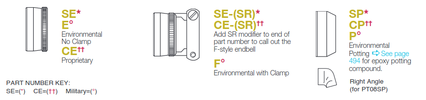

# Conector militar
En MS4M se usan 4 tipo de conectores para la control screen. Los número de parte iniciales son los siguientes:

* **KPSE6E16-26PDN:** Usado para el cable arnes con pines machos
* **KPSE6E16-26SDN:** Usado para el cable arnes con pines hembra.
* **KPT7A16-26SEW:** Este es un conector hembra, se encuentra en la control screen.
* **KPT7A16-26PEW:** Este es un conector macho, se encuentra en la control screen.

## ¿Como seleccionar un conector militar para cable arnes?

Lo primero que de debe hacer es escoger el standar con el cual se va a trabajar, estos estandares tienen impacto en la calidad y precio del conector.

### MS3126, PT06, KPTSE06, KPSE05A, 85106
Los conectores que comiencen por esta serie son usando para armar cable arnes.

{align=center}

El conector **KPSE05A** cuenta con menos tipo de backshell.

### Escoger el tipo de backshell

Este valor esta representado por una letra que tiene equivalencia con la siguiente imagen:

Entonces para hacer un cable arnes, se podria escoger en principio

1. MS3126 **A**  
2. MS3126 **E**
3. PT06 **SE-(SR)**
4. PT06 **CE-(SR)**

13. KPTSE06 **F**
14. PT06 **SP**
15. PT06 **CP**
16. PT06 **P**
3. MS3126 **A-(SR)**
4. MS3126 **E-(SR)**  
5. MS3126 **F**
6. MS3126 **J**

Para la serie 851 se tiene otras letras de equivalencia que se muestra en la siguiente imagen:

Nota: Las primeras letras hacen referencia al pin para soldar y el segundo para crimpar. En nuestro caso siempre buscaremos 
la serie para crimpar.

El código para esta serie iría quedando de la siguiente forma.

7. 85106 **RA**
8. 85106 **R**
9. 85106 **RT**
10. 85106 **RM**
11. 85106 **RG**
12. 85106 **RZ**

### Escoger el Layout

Lo siguiente es escoger la cantidad de pines, en este caso siempre sera **16-26** este valor no puede cambiar.

Se puede ver la forma en la siguiente imagen.

Se podria, aumentar la especificacion entonces de la siguiente forma:

1. MS3126 **A** **16-26**
2. MS3126 **E** **16-26**
3. MS3126 **A-(SR)** **16-26**
4. MS3126 **E-(SR)** **16-26**
5. MS3126 **F** **16-26**
6. MS3126 **J** **16-26**
7. MS3126 **W** **16-26**
8. MS3126 **P** **16-26**
9. PT06 **A** **16-26**
10. PT06 **E** **16-26**
11. PT06 **A-(SR)** **16-26**
12. PT06 **E-(SR)** **16-26**
13. PT06 **F** **16-26**
14. PT06 **J** **16-26**
15. PT06 **W** **16-26**
16. PT06 **P** **16-26**
17. 85106 **RA** **16-26**
18. 85106 **R** **16-26**
19. 85106 **RT** **16-26**
20. 85106 **RM** **16-26**
21. 85106 **RG** **16-26**
22. 85106 **RZ** **16-26**

### Tipo de contactos

En este caso se escoge la **P** para conectores machos y **S** para conectores hembra.

El número de parte quedaria de la siguiente forma:

| **Hembra**                 | **Macho**                  |
|------------------------|------------------------|
| MS3126 **E** **16-26** **S**  | MS3126 **E** **16-26** **P** |
| MS3126 **J** **16-26** **S**  | MS3126 **J** **16-26** **P** |
| MS3126 **P** **16-26** **S**  |  MS3126 **P** **16-26** **P**|
| PT06 **SE** **16-26** **S**    | PT06 **A** **16-26** **P**|
| PT06 **CE** **16-26** **S**    | PT06 **E** **16-26** **P**|
| PT06 **SE** **16-26** **S** **(SR)**| PT06 **SE** **16-26** **P** **(SR)**|
| PT06 **CE** **16-26** **S** **(SR)**| PT06 **CE** **16-26** **P** **(SR)**|
| PT06 **F** **16-26** **S**| PT06 **F** **16-26** **P**|
| PT06 **SP** **16-26** **S**| PT06 **SP** **16-26** **P**|
| PT06 **CP** **16-26** **S**| PT06 **CP** **16-26** **P**|
| PT06 **P** **16-26** **S**| PT06 **P** **16-26** **P**|
|85106 **RA** **16-26** **S**    |85106 **RA** **16-26** **P**|
|85106 **R** **16-26** **S**    |85106 **R** **16-26** **P**|
|85106 **RT** **16-26** **S**    |85106 **RT** **16-26** **P**|
|85106 **RM** **16-26** **S**    |85106 **RM** **16-26** **P**|
|85106 **RG** **16-26** **S**    |85106 **RG** **16-26** **P**|
|85106 **RZ** **16-26** **S**    |85106 **RZ** **16-26** **P**|

### Seleccionar rotación

Los conectores que usamos no cuentan con rotación, por lo que ese valor se deja en blanco. Una rotación **W,X,Y o Z** no funciona en nuestro caso.

Entonces conociendo esto, la tabla anterior quedaría de la misma forma.

| **Hembra**                 | **Macho**                  |
|------------------------|------------------------|
|MS3126A16-26        |MS3126A16-26P |
|MS3126E16-26S       |MS3126E16-26P |
|MS3126A-(SR)16-26   |MS3126A-(SR)16-26|
|MS3126E-(SR)16-26S  |MS3126E-(SR)16-26P|
|MS3126F16-26S   |[MS3126F16-26P](https://renhotecpro.com/product/mil-dtl-26482-series-1-connectorMS3126f16-26p-male-cable-mount-plug26-pin-solder) |
|MS3126J16-26S   |MS3126J16-26P|
|MS3126W16-26S   |MS3126W16-26P|
|MS3126P16-26S   |MS3126P16-26P|
|PT06SE16-26S     |PT06SE16-26P|
|PT06CE16-26S     |PT06CE16-26P|
|PT06SE16-26S(SR)|PT06SE16-26P(SR)|
|PT06F16-26S     |PT06F16-26P|
|PT06SP16-26S     |PT06SP16-26P|
|PT06CP16-26S     |PT06CP16-26P|
|PT06P16-26S     |PT06P16-26P|
|85106RA16-26S   |85106RA16-26P|
|85106R16-26S    |85106R16-26P|
|85106RT16-26S   |85106RT16-26P|
|85106RM16-26S   |85106RM16-26P|
|85106RG16-26S   |85106RG16-26P|
|85106RZ16-26S   |85106RZ16-26P|

### Modificador

Este ultimo parametro impacta en el acabado del conector, obteniendo asi los siguentes acabados.

Para la serie 851 estos serían los modificadores que le corresponde

 

* [Hoja de datos de conector militar ITT](https://www.peigenesis.com/images/products/pdf/fullspec_can__kpse.pdf)
* [Hoja de datos de conector militar Amphenol](https://www.peigenesis.com/images/content/pei_tabs/amphenol/pt-ptse-series/new-thumbs/123-146_pt_series.pdf)
* [Hoja de datos de conector militar Pei-Genesis](https://www.peigenesis.com/images/content/pei_tabs/souriau/851-series/eaton-souriau-MILDTL26482-connector-851-catalog-en-us.pdf)

### KPT7 (RECEPTACLES)

